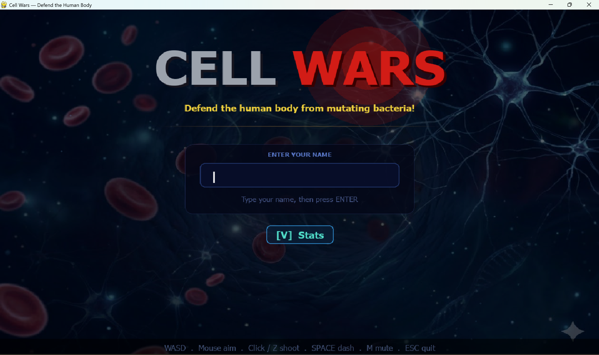
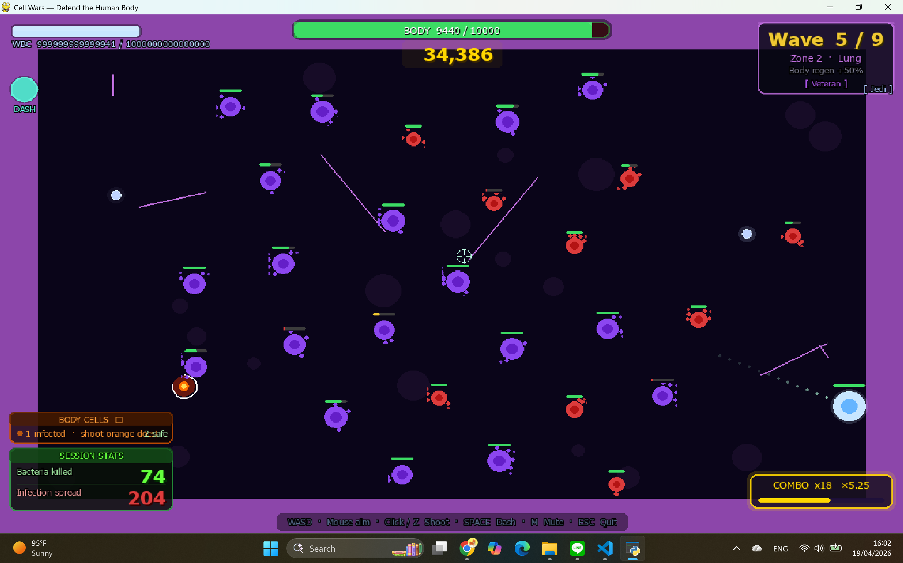
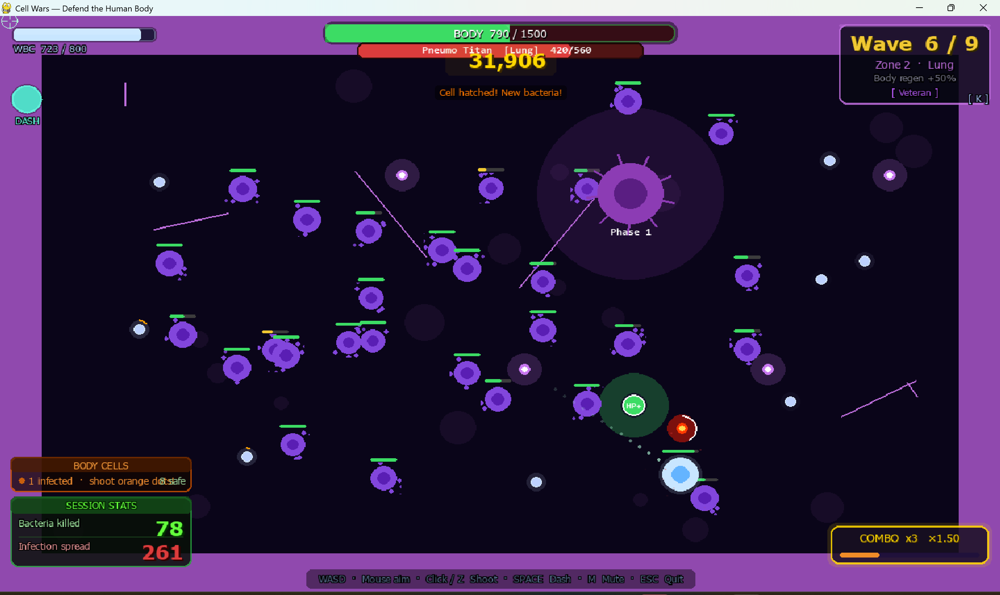
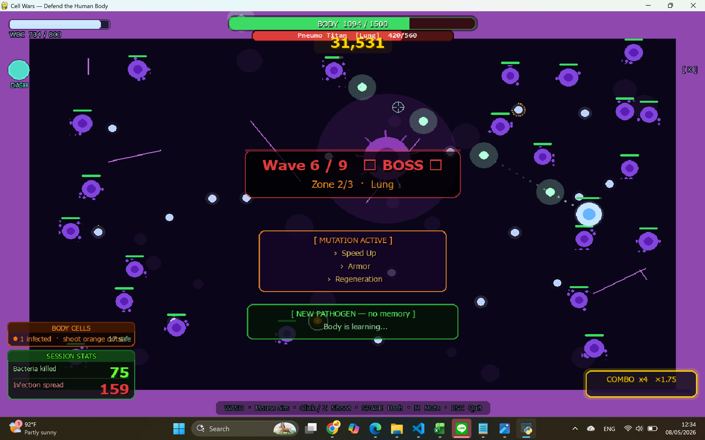
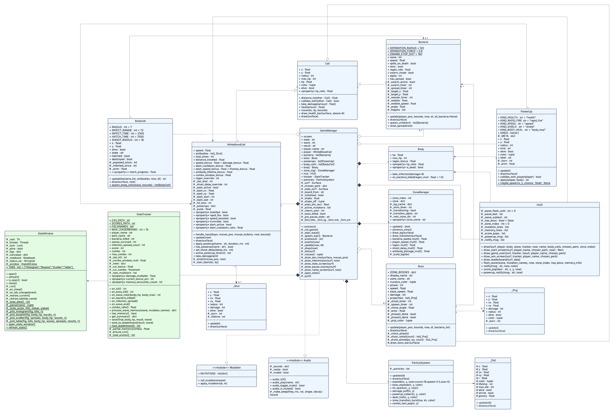

# Project Description

## 1. Project Overview

* **Project Name:** Cell Wars

* **Brief Description:**

  Cell Wars is a top-down wave survival game built with Python and Pygame. You play as a White Blood Cell defending the human body from waves of bacteria. The game is split into several organ zones, each with its own environment modifiers that things like player speed, regen rate, and how tough the bacteria get. Your job is to shoot antibody projectiles, dodge enemies, and keep the body's HP from hitting zero before the bacteria do.

  At the start of each session the game randomly assigns you one of four perks (Field Medic, Gunner, Sprinter, or Veteran), which change your actual stats in the code rather than just being cosmetic. Each wave rolls a random set of mutations from a pool of seven, so bacteria in later waves can regenerate, turn invisible, split on death, go toxic, or start swarming you. There's also an immune memory system built into `StatsTracker` that gives you a damage bonus when you face a mutation combo you've seen before. Every session automatically saves stats to `gameplay_stats.csv` and `highscores.json`, and you can open a live stats window at any point during the game by pressing V.

* **Problem Statement:**

  Most OOP assignments only demonstrate concepts through small console programs, which don't show how object-oriented design actually holds up in a larger interactive system. This project tries to fix that by building a full real-time game where inheritance, encapsulation, composition, and modular design all have to work together at the same time, not just in isolated examples.

* **Target Users:**
  * Students learning Object-Oriented Programming
  * People who want to get started with Pygame game development
  * Casual players who enjoy wave survival games
  * Anyone interested in collecting and visualizing gameplay data

* **Key Features:**
  * Wave-based survival across multiple organ zones with different environment modifiers per zone
  * Four perks (Field Medic, Gunner, Sprinter, Veteran) that modify actual player/body attributes in code
  * Bacteria mutation system with 7 mutations (Speed Up, Armor, Split, Camouflage, Toxic, Regeneration, Swarm) rolled randomly per wave, scales with wave number
  * Immune memory system `StatsTracker` remembers mutation combos you've faced and gives increasing damage bonus on repeat encounters
  * Body cell infection mechanic, bacteria can infect body cells, which hatch into new bacteria if you don't shoot them in time
  * Boss fights every 3 waves with projectile attacks
  * Combo score system with persistent JSON leaderboard
  * Collectible power-ups include 5 types: health restore, rapid fire, speed boost, shield (damage block), and body heal that dropped by bacteria at a 20% chance, plus a dash mechanic with cooldown and I-frames
  * Procedurally generated sound effects using NumPy and `pygame.sndarray` no external audio files
  * Live stats window via Tkinter + matplotlib, accessible with V from any screen
  * Automatic CSV and JSON stat recording every session

---

### Screenshots

**Title Screen**



**Gameplay**



**Boss Fight**



**Boss Phases**



---

### Proposal

[View Project Proposal PDF](Project%20Proposal.pdf)

---

### YouTube Presentation

▶ [Watch the Full Presentation](https://www.youtube.com/watch?v=-kj-OaRxY5Y)

The video covers:
1. A full walkthrough of the game and the stats dashboard
2. An explanation of the class design and how OOP is used in the actual code
3. A breakdown of the statistics system and data visualization

---

## 2. Concept

### 2.1 Background

The idea came from wanting to make something that actually demonstrates OOP in a real interactive system rather than a small console program. The human immune system fits a survival game structure really well and the player is a White Blood Cell, the enemies are bacteria, and the thing you're protecting is the Body's HP.

The part I spent the most time on is the **bacteria mutation system**. Each wave rolls mutations from a pool of seven in `mutation.py`. The number of mutations scales with wave number, so early waves are straightforward but later waves can have bacteria that regenerate, turn semi-transparent, split into two weaker bacteria when killed, or start actively chasing you. This keeps enemy behavior unpredictable enough that you can't just use the same strategy every time.

The **immune memory system** in `StatsTracker` adds another layer to this. It tracks which mutation combinations you've faced before. If you see the same combo again, your damage multiplier increases. But if the wave includes mutations you haven't encountered yet, the bonus gets penalized. It's meant to reward players who survive long enough to actually learn the patterns.

Aside from gameplay, I wanted to show that data collection and visualization can be embedded directly in a game system without needing a separate program for it.

* **Why this project exists:** To show that OOP concepts hold up in a full interactive system where multiple classes have to communicate in real time, not just in a textbook example.
* **What inspired it:** The human immune system and classic wave survival arcade games.
* **Why it matters:** The project combines OOP, real-time game programming, procedural audio, data collection, and visualization in a single application.

### 2.2 Objectives

* Build a fully playable wave survival game using Python and Pygame
* Apply OOP concepts - inheritance, encapsulation, composition that throughout the entire codebase, not just in one or two places
* Design a class structure where each file has a clear, single responsibility
* Implement adaptive enemy behavior through a randomized mutation system and immune memory
* Automatically record gameplay stats to CSV and JSON every session
* Visualize session data using charts and a summary table via matplotlib
* Combine gameplay systems, software design, and statistical analysis into one application

---

## 3. UML Class Diagram



[View UML PDF](cell_wars_uml.pdf)

The diagram shows all classes with their attributes, methods, and relationships. Main relationships used in the project:

| Relationship | Classes |
|---|---|
| Inheritance | `Cell` → `WhiteBloodCell` |
| Inheritance | `Cell` → `Bacteria` |
| Inheritance | `Cell` → `Boss` |
| Composition | `GameManager` ◆ `WhiteBloodCell` |
| Composition | `GameManager` ◆ `StatsTracker` |
| Composition | `GameManager` ◆ `HUD` |
| Composition | `GameManager` ◆ `ZoneManager` |
| Composition | `GameManager` ◆ `ParticleSystem` |
| Composition | `GameManager` ◆ `Body` |
| Aggregation | `GameManager` ◇ `Bacteria` (list) |
| Aggregation | `GameManager` ◇ `Boss` (0..1) |
| Aggregation | `GameManager` ◇ `PowerUp` (list) |
| Aggregation | `GameManager` ◇ `BodyCell` (list) |
| Association | `WhiteBloodCell` → `_Shot` (creates & owns list) |
| Association | `Boss` → `_Proj` (creates & owns list) |
| Association | `Boss` → `Bacteria` (Phase 3 spawns) |
| Association | `Bacteria` → `Body` (infection spread) |
| Association | `BodyCell` → `Bacteria` (hatches into) |
| Dependency | `GameManager` ····→ `Mutation` module |
| Dependency | `GameManager` ····→ `Audio` module |
| Dependency | All classes ····→ `Config` module |

---

## 4. Object-Oriented Programming Implementation

| Class / Module | File | Description |
|---|---|---|
| **Cell** | `cell.py` | Base class for every entity in the game. Stores `x`, `y`, `radius`, `max_hp`, `hp`, `color`, and `alive`. Provides shared methods: `take_damage()`, `heal()`, `move()` with boundary clamping, `distance_to()`, `collides_with()` using circle distance, `draw_health_bar()` with color based on `hp_ratio` property, and an abstract `draw()` that subclasses are required to implement. |
| **_Shot** | `white_blood_cell.py` | Standalone class (defined at module level in the same file as `WhiteBloodCell`, not a nested inner class). Represents one antibody projectile. Stores `x`, `y`, `vx`, `vy`, `radius`, `damage`, `alive`, `_born`, and `_lifetime`. Destroyed automatically when it leaves its lifetime window. |
| **WhiteBloodCell** | `white_blood_cell.py` | The player character. Inherits from `Cell`. Handles WASD/arrow movement, mouse and Z-key aiming, antibody shooting (creates `_Shot` objects stored in `self.antibodies`), dash with cooldown and speed multipliers, I-frame invincibility after taking damage, perk stat multipliers (`speed_bonus`, `damage_bonus`, `dash_cooldown_bonus`, etc.), and a time-based power-up system. |
| **Bacteria** | `bacteria.py` | Enemy class. Inherits from `Cell`. Has two movement modes: wander (picks random targets every 2–3 seconds) and swarm (chases the player directly, switches on a 30% random chance every 2 seconds when `swarm_mode=True`). Supports all mutation flags (`toxic`, `regen_rate`, `splits_on_death`, `alpha`, `swarm_mode`). Includes a separation force to prevent bacteria from stacking on top of each other, and `spawn_children()` for the split mutation. |
| **_Proj** | `boss.py` | Standalone class (defined at module level in the same file as `Boss`). Represents one boss projectile. Stores `x`, `y`, `vx`, `vy`, `damage`, `radius`, `alive`, `color`, and `_born` (auto-expiry timer). |
| **Boss** | `boss.py` | A boss enemy that appears every wave divisible by `BOSS_WAVE_INTERVAL`. Inherits from `Cell`. Has 3 combat phases triggered at ≤66% and ≤33% HP: Phase 1 fires 6-way radial shots (interval 200 frames); Phase 2 fires 8-way radial + 1 aimed shot at the player, speed ×1.25 (interval 120 frames); Phase 3 fires 12-way radial + 3-way aimed shots, speed ×1.6, and spawns 2 bacteria every 240 frames (~4 s at 60 FPS). Each boss has a zone-themed name (e.g. *Blood Clot*, *Pneumo Titan*, *Cardiac Reaper*, *Neuro Parasite*, *Toxin Warlord*, *Acid Behemoth*). |
| **_Dot** | `particles.py` | Standalone helper class (defined at module level in the same file as `ParticleSystem`). Uses `__slots__` for performance. Represents a single visual particle with position, velocity, color, radius, lifetime, gravity, and shrink flag. `update(dt)` applies physics and fades; `draw(surface)` renders with per-frame alpha using `pygame.SRCALPHA`. |
| **BodyCell** | `body_cell.py` | **Standalone class — does not inherit from `Cell`.** Defines its own `x`, `y`, `alive`, `state` attributes. Starts in safe state `"S"`. When a bacterium contacts it, transitions to infected state `"I"` and starts a countdown (`INFECT_TIME = 2500 ms`, `HATCH_TIME = 7000 ms`). If the player shoots it in time, `update()` returns `"destroyed"` and `GameManager` awards +300 score. If time runs out, it returns `"spawn"` and `GameManager` creates a new `Bacteria` at that position. |
| **Body** | `body.py` | Tracks the body's total HP (`BODY_MAX_HP = 1500`). Takes infection damage when bacteria spread. Supports a `regen_bonus` multiplier, which the Field Medic perk sets to 2.0. Exposes `hp_ratio` and `is_dead` as properties. |
| **GameManager** | `game_manager.py` | The main controller. Manages the entire 11-state machine: `S_NAME` → `S_START` → `S_PLAY` / `S_BOSS` → `S_INTERM` → `S_ZONE` → `S_OVER` / `S_WIN`, plus `S_PAUSE` (overlay during play/boss), `S_STATS` (chart view), and `S_BOARD` (leaderboard). Handles wave spawning, all collision detection, perk application via `_apply_perk()`, boss lifecycle, power-up collection, screen shake, the dotted aim line, and saving stats on exit. The largest file in the project at 741 lines. |
| **ZoneManager** | `zone_manager.py` | Handles organ zone transitions and per-zone environment modifiers — player speed multiplier, bacteria speed multiplier, antibody damage multiplier, regen multiplier, and zone-specific background rendering. |
| **HUD** | `hud.py` | Renders all on-screen UI: HP bars, score, combo counter, wave info, active perk badge, dash cooldown arc, power-up timers, immune memory badge, floating score pop-ups, wave flash messages, mutation flash, body cell status panel, the leaderboard screen, the perk selection screen, the game over screen, and the win screen. The largest UI file at 978 lines. |
| **StatsTracker** | `stats_tracker.py` | Records all session stats: `bacteria_killed`, `waves_survived`, `infection_spread_count`, `score`, `combo`, `max_combo`, and `perk`. Implements a combo multiplier system (+0.25 per consecutive kill) and an immune memory system through `process_wave_memory()`, which tracks seen mutation combos as frozensets and returns a damage bonus based on past encounters. Saves to CSV via `save()` and to JSON leaderboard via `save_to_leaderboard()`. |
| **StatsVisualizer** | `stats_visualizer.py` | **A module, not a class** — contains only module-level functions (`load_data()`, `plot_save()`, `plot()`, `_do_plot()`, `_style_ax()`). Reads the CSV using Python's `csv.DictReader` and `numpy` arrays. Generates a 4-panel matplotlib figure: histogram, boxplot, scatter plot with a linear trend line from `np.polyfit`, and a styled statistical summary table. Saves the result as `stats_chart.png`. |
| **StatsWindow** | `stats_window.py` | Contains a `StatsWindow` class that opens a separate Tkinter window with a tabbed notebook (Histogram, Boxplot, Scatter, Table). The class runs in a background thread and holds `Figure` and `FigureCanvasTkAgg` objects per tab. Module-level functions `open_stats_window()` and `refresh_stats()` manage a singleton instance, which `GameManager` calls from any screen via the V key. |
| **ParticleSystem** | `particles.py` | Handles all visual effects using a list of `_Dot` objects. Provides emitter methods: `explode()`, `boss_explode()`, `hit_sparks()`, `damage_puff()`, `dash_trail()`, `powerup_collect()`, `zone_transition_burst()`, and `combo_text_pop()`. `update(dt)` ticks all live dots and removes dead ones; `draw(surface)` renders them all. |
| **PowerUp** | `powerup.py` | Collectible items that drop from bacteria via the module-level `maybe_spawn()` function at a 20% drop chance. Has **5 kinds**: `health` (restore player HP), `rapid_fire` (reduce shoot delay), `speed_boost` (increase move speed), `shield` (block next hit), and `body_heal` (restore body HP directly). The `apply()` method modifies the relevant object and returns a display string for the HUD. |
| **Mutation Module** | `mutation.py` | Defines a pool of 7 mutations. Each entry has a `name`, a `shift` tuple that tints the bacteria's color to show it's mutated, and an `apply` lambda that sets the relevant flag on the `Bacteria` object directly. `roll_mutations(wave)` samples `min(3, wave // 2)` mutations per wave. |
| **Audio Module** | `audio.py` | Generates all sound effects (shoot, kill, combo, player_hit, boss_hit, powerup, wave_clear, etc.) using NumPy waveform synthesis and `pygame.sndarray`. No external audio files are used anywhere. |
| **Config Module** | `config.py` | Stores all global constants: screen dimensions, player stats, antibody stats, bacteria scaling values, wave settings, zone configurations, color palette, and all gameplay balance numbers. |

---

## 5. Statistical Data

### 5.1 Data Recording Method

`StatsTracker` records stats during the session through event methods that `GameManager` calls at the right moments:

- A bacterium dies → `on_bacteria_killed()` increments `self.bacteria_killed`, and `on_kill()` handles the combo multiplier and score
- A bacterium spreads infection → `on_infection_spread()` increments `self.infection_spread_count`
- A wave is cleared → `on_wave_end()` increments `self.waves_survived`, and `on_wave_clear()` adds wave clear bonus score
- Session ends (win, loss, or quit) → `GameManager._end()` calls `tracker.save(body.hp, result, wave)`, which appends one row to `gameplay_stats.csv` and updates `highscores.json`

The CSV header is created automatically the first time through `_ensure_csv()` in `StatsTracker.__init__()`, so no manual setup is needed. Every session always writes exactly one row.

### 5.2 Data Features

| Feature | Variable in code | Class | How it's collected | Visualization |
|---|---|---|---|---|
| `bacteria_killed` | `self.bacteria_killed` | `StatsTracker` | `on_bacteria_killed()` increments by 1 each kill | Histogram (X: kill count, Y: number of sessions) |
| `final_body_hp` | `Body.hp` | `Body` | Read at session end, passed into `save()` | Boxplot grouped by result (WIN / LOSS / QUIT) |
| `waves_survived` | `self.waves_survived` | `StatsTracker` | `on_wave_end()` increments by 1 each wave clear | Summary statistics table |
| `infection_spread_count` | `self.infection_spread_count` | `StatsTracker` | `on_infection_spread()` increments by 1 each spread event | Scatter plot vs `final_body_hp` with trend line |
| `result` | string `"win"` / `"loss"` / `"quit"` | `GameManager` | Set in `_end(result)`, passed into `save()` | Frequency count in summary table |
| `perk` | `self.perk_name` | `StatsTracker` | Passed in at `__init__` from the chosen perk | Frequency count in summary table |

**Statistical values reported per numeric feature:** Mean, Median, Min, Max, Standard Deviation

Charts generated automatically by `stats_visualizer.py`:

| Chart | X-axis | Y-axis | Purpose |
|---|---|---|---|
| Histogram | Kill count | Number of sessions | Show the distribution of kills per session |
| Boxplot | Result (WIN / LOSS / QUIT) | Body HP | Compare remaining body HP across different outcomes |
| Scatter plot + trend line | Infection spread count | Final body HP | Show whether more infection spreads leads to lower body HP |
| Statistical summary table | — | — | Mean, Median, Min, Max, SD for all numeric features plus result frequency |

---

## 6. Changed Proposed Features

| Added / Changed | Why |
|---|---|
| Bacteria mutation system (7 mutations, randomized per wave) | The proposal only said "different enemy behaviors." I ended up building a proper randomized mutation pool that scales with wave number, which made the enemy difficulty feel more natural and less repetitive. |
| Immune memory system in `StatsTracker` | This wasn't in the proposal at all. I added it because I wanted players who survive long enough to actually get rewarded for learning mutation patterns, rather than every wave feeling the same difficulty. |
| Body cell infection and hatching | Added a whole `BodyCell` class and spawn system to create a different kind of time pressure — instead of just dodging bacteria, you also have to clear infected cells before they hatch. |
| Multi-phase boss fights | The proposal said "possible boss battles." The final version has a proper interval-based boss system tied to zone transitions, with projectile attacks and multiple phases. |
| Live stats window (Tkinter) | Added so you can check your stats mid-game without quitting. The window updates every time a wave ends. |
| Procedural audio using NumPy | Wasn't in the proposal. I added it to remove external audio file dependencies and also because it was a good way to use NumPy for something other than data analysis. |
| Four player perks | The proposal didn't mention perks. I added them to improve replayability and to demonstrate modifying object attributes through OOP — each perk directly sets values on `WhiteBloodCell` and `Body` objects at game start. |

---

## 7. External Sources

| Item | Source | License |
|---|---|---|
| Pygame | https://www.pygame.org | LGPL 2.1 |
| NumPy | https://numpy.org | BSD 3-Clause |
| matplotlib | https://matplotlib.org | PSF License |
| Python Standard Library | Python Software Foundation | PSF License |
| Title screen background image | Generated using Google Gemini | AI-generated by project author |
| Sound effects | Procedurally generated using NumPy and `pygame.sndarray` | Original implementation |

All gameplay source code in this repository was written by the project author for this project.

---

## Controls

| Key | Action |
|---|---|
| `WASD` | Move |
| `Mouse` / `Z` | Shoot |
| `SPACE` | Dash |
| `V` | Open stats window (works from any screen) |
| `P` | Pause / Resume |
| `M` | Toggle mute |
| `ESC` / `Q` | Quit |

---

## Installation

```bash
pip install -r requirements.txt
python main.py
```
