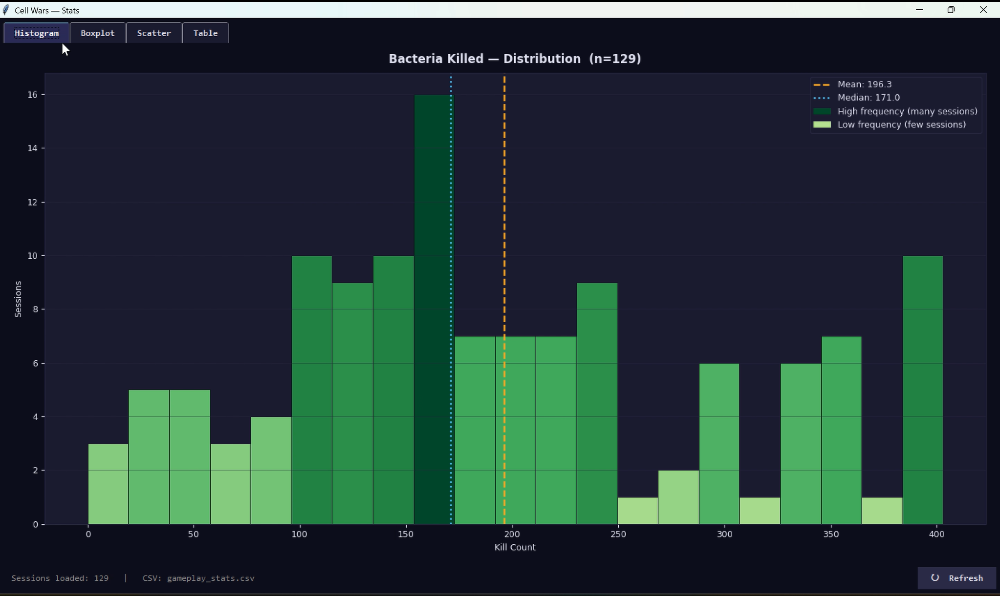
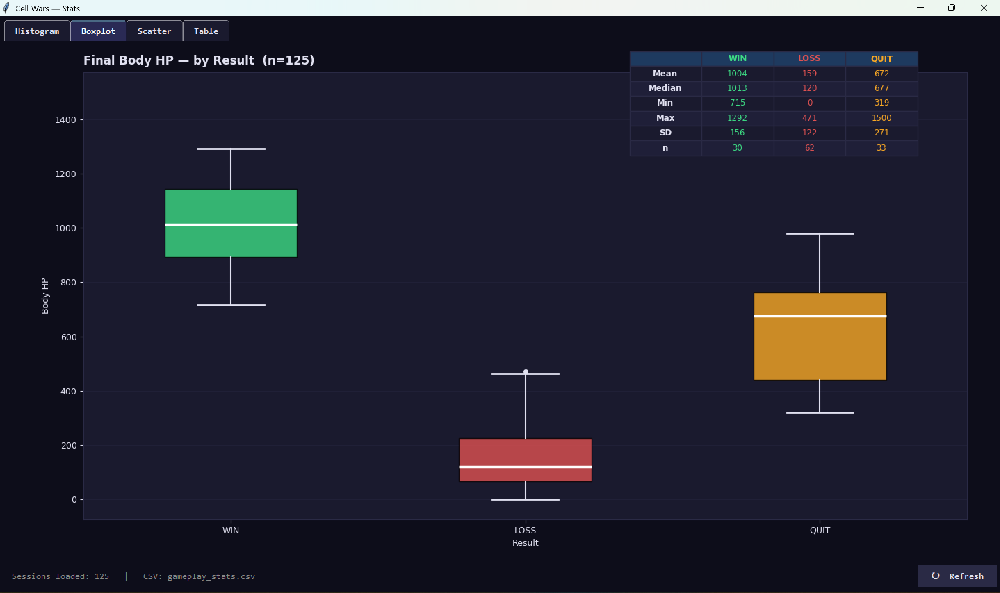
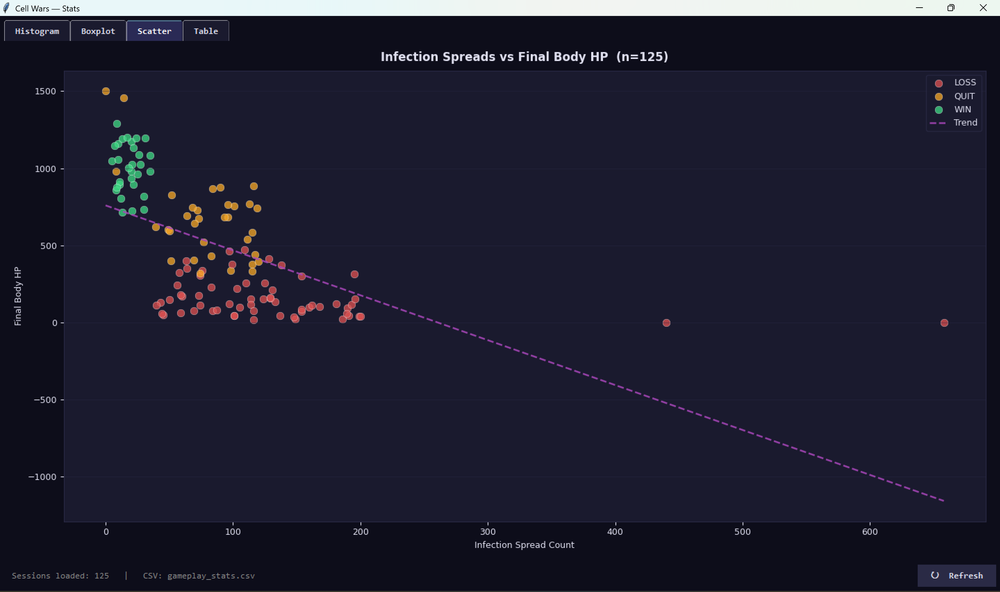
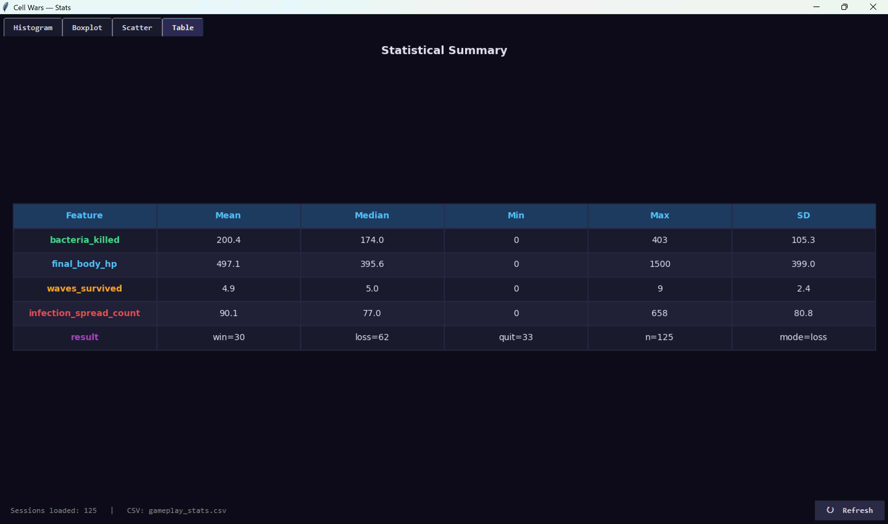

# Cell Wars - Data Visualization

**Project by:** Panisara Niyathirakul (6810545751)

---

## Visualizations

All four charts are generated by `stats_visualizer.py`, which reads `gameplay_stats.csv` using `csv.DictReader` and converts the values into NumPy arrays. The same four charts also appear as tabs in the live `StatsWindow` (Tkinter), which you can open anytime during the game by pressing **V**.

---

### Chart 1 - Histogram: Bacteria Killed Distribution

This histogram shows how the number of bacteria killed is distributed across all recorded sessions. It makes it easy to see what a typical kill count looks like for most players, and whether high-kill sessions are common or just a few outliers pulling the average up. The mean and median lines are shown together so you can tell at a glance whether the distribution is balanced or skewed toward one side.

---

### Chart 2 - Boxplot: Final Body HP by Result

This boxplot compares the body's remaining HP at the end of each session, grouped by outcome include win, loss and quit. It shows not just the average for each group but also how spread out the values are, so you can see whether wins tend to be comfortable or close calls and whether losses happen early or late in the game. The three groups sitting at very different HP ranges also confirms that final body HP is a strong indicator of how the session went.

---

### Chart 3 - Scatter Plot: Infection Spread vs Final Body HP

Each dot in this scatter plot is one session, colored by its result. The X-axis is the total number of times bacteria successfully spread infection, and the Y-axis is the body's final HP. The trend line shows the general direction of the relationship between the two variables that whether letting more bacteria spread tends to end with lower body HP or not. Sessions where infection was kept under control and sessions where it ran out of hand tend to end up in very different parts of the chart.

---

### Chart 4 - Statistical Summary Table

This table gives a full numerical summary of all four numeric features such as mean, median, min, max, and standard deviation that plus a frequency breakdown of the result and perk columns. It is useful for getting a quick overview of how the data looks across all sessions at once, and for spotting features that have high variance or extreme outliers compared to the rest.
